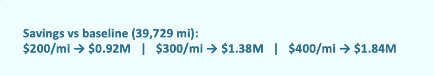
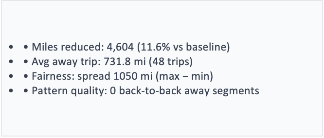
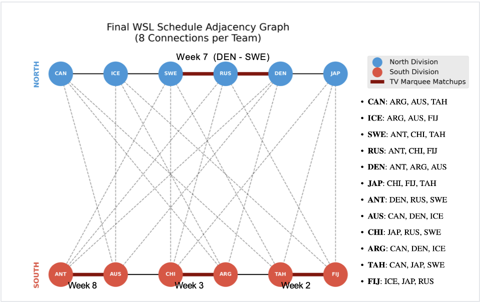

# Sports Scheduling Optimization

This project develops an optimization-based schedule for the fictitious Worldwide Softball League (WSL) using Mixed-Integer Linear Programming (MILP) in Python with Gurobi.

The goal was to build a 9-week schedule for a 12-team league while satisfying hard scheduling rules and improving travel efficiency, fairness, and weekly broadcast value.

---

## Project Overview

The league consists of 12 teams split into two divisions:

- **North:** CAN, ICE, SWE, RUS, DEN, JAP
- **South:** ANT, AUS, CHI, ARG, TAH, FIJ

Each team must:

- Play **8 total games**
- Have **4 home games, 4 away games, and 1 bye**
- Play **all 5 divisional opponents exactly once**
- Play **3 cross-division opponents**
- Avoid bad away-game patterns

In addition to feasibility, the model tries to:

- Minimize total travel
- Improve travel fairness across teams
- Spread marquee TV matchups across different weeks

---

## Optimization Approach

I formulated the problem as a **Mixed-Integer Linear Program (MILP)** with binary decision variables representing:

- who plays whom
- where the game is played
- in which week the game is scheduled

The model includes:

- league structure constraints
- home/away balance constraints
- cross-division scheduling rules
- travel-pattern restrictions
- fairness terms in the objective
- TV matchup separation constraints

The model was implemented in **Python** and solved using **Gurobi**.

---

## Key Results

The final schedule achieved:

- **Total away-team travel:** 35,125 miles
- **Travel spread (max - min):** 1,050 miles
- **Zero back-to-back away sequences**
- **All marquee matchups scheduled in distinct weeks**

Example marquee weeks:
- Week 2: TAH vs FIJ
- Week 3: CHI vs ARG
- Week 7: SWE vs DEN
- Week 8: ANT vs AUS

---

## Results Snapshot

This optimization model produced a feasible 9-week schedule while improving travel efficiency, fairness, and broadcast quality.

### Estimated Savings vs Baseline

### KPI Summary

### Final Schedule Structure

---

## Files in This Repository

This repository includes:

- `SportsSchedulingWSL.ipynb` – main optimization notebook with model formulation and implementation
- `schedule_WSL.txt` – final submitted schedule in required `HOME AWAY WEEK` format
- `ProjectReport_SportsScheduling.pdf` – project report with formulation, constraints, results, and discussion
- `WSL_Scheduling_Optimization_Ashutosh_Srivastava.pptx` – presentation summarizing the business problem, model, and outcomes

---

## Tools and Skills Used

- Python
- Gurobi
- Mixed-Integer Linear Programming (MILP)
- Optimization Modeling
- Scheduling
- Constraint Modeling

---

## Why This Project Matters

Sports scheduling is a strong example of how optimization can support real operational decisions.

This project shows how vague business rules can be converted into a mathematical model and solved in a way that balances:

- operational feasibility
- cost reduction
- fairness
- stakeholder preferences

It reflects the kind of structured decision-making used in sports analytics, airline planning, logistics, and operations research.

---

## Author

**Ashutosh Srivastava**  
M.S. in Industrial & Systems Engineering  
Virginia Tech

---

## Notes

This project was developed as part of an academic optimization project and is shared here as a portfolio example of mathematical modeling and decision optimization.
